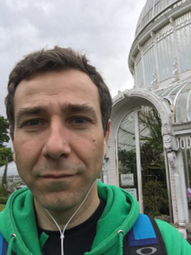

# Pedro's Astronomy Page

I am a lecturer at the School of Maths and Physics of Queen’s University Belfast and do research in solar system astronomy at the Astrophysics Research Centre.

My past work has been mainly on physical properties of small bodies of the solar system, mainly Kuiper belt objects (KBOs), Centaurs, comets and Trojan asteroids.

## Things about me
- [CV](http://go.qub.ac.uk/v4dbc)
- [Publications](https://goo.gl/ziFXpu)
- Teaching
- [Colleagues](Colleagues.html)
- News
- [Photos](http://www.flickr.com/photos/pedrocas/)
- [Sounds](http://soundcloud.com/corpode)

## Contact information
Astrophysics Research Centre
Queen’s University Belfast  
Belfast, BT7 1NN   
   United Kingdom